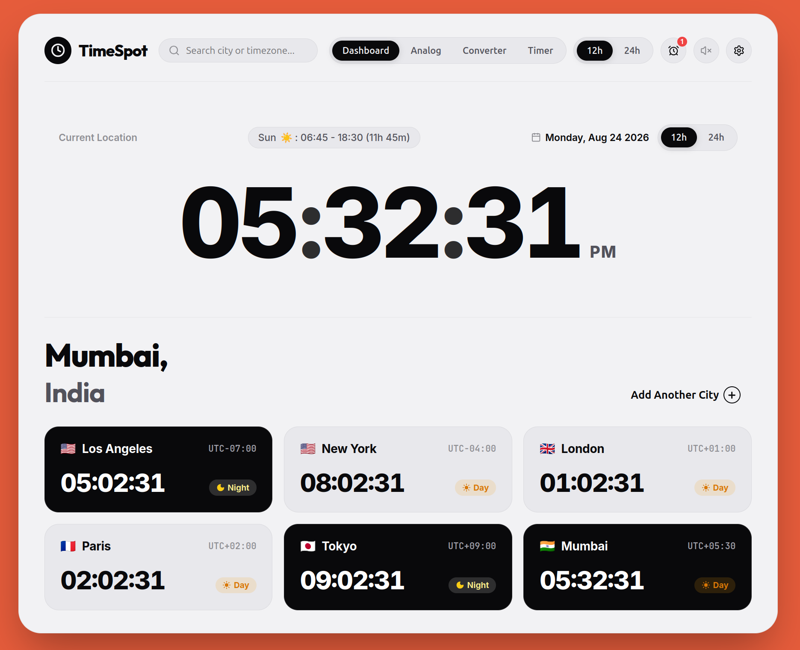

# Practical 2: TimeSpot - Real-Time World Clock Dashboard

**Course**: Web Technologies  
**Tech Stack**: React 19, Vite, HTML5 Canvas / SVG, Web Audio API, Lucide React  
**Architecture**: Component-Driven Real-Time Reactive System  

---

## Project Overview



---

## Problem Statement & Objectives

Build an advanced real-time clock dashboard application using **React** that combines:
1. **Analog Clock** with dynamic clock faces and smooth 60 FPS sweeping movement.
2. **Digital Clock** with live tab title synchronization, 12h/24h toggles, and UTC offsets.
3. **Time Zone Management** with popular global cities, search filter, custom city addition, and time conversion slider.
4. **Alarm Features** with multi-alarm management, category tags, audio synthesizer alerts, snooze, and dynamic ringing overlay.
5. **Stopwatch & Countdown Timer** with custom duration inputs (hours, minutes, seconds) and split-lap recording.
6. **Dynamic UI Controls** including theme customization, accent color picker, dial face selector, sound effects, and fullscreen mode.

---

## Features Breakdown

1. **Analog Clock Engine**:
   - High-precision smooth sweeping second hand (`~60fps` animation loop via `useClock` hook).
   - 4 dial face styles: Chronograph, Classic, Minimalist, and Cyberpunk.
   - Interactive 3D parallax tilt effect on mouse movement.

2. **World Clock Grid & Spotlight Focus View**:
   - Monitor real-time local times across worldwide timezones.
   - Filterable timezone search and custom city additions.
   - Dedicated Focus View spotlighting individual city solar diurnal cycle curves.

3. **Time Zone Converter**:
   - Interactive 24-hour timeline slider comparing local time across all configured cities simultaneously.

4. **Multi-Alarm System & Web Audio**:
   - Configurable alarms with title, time, category (Work, Personal, Fitness, Health), snooze interval, and sound options.
   - Built-in Web Audio API synthesizer generating digital beeps and alarms without external audio dependencies.
   - Confetti particle celebration on alarm dismissal via `canvas-confetti`.

5. **Stopwatch & Countdown Timer**:
   - High-precision split-lap stopwatch with fastest/slowest lap detection.
   - Countdown timer with custom hour/minute/second inputs and quick duration presets.

---

## Directory Structure

```text
Assignment2_ClockDashboard/
├── src/
│   ├── components/
│   │   ├── AlarmManager.jsx       # Alarm creation & listing
│   │   ├── AlarmModal.jsx         # Ringing overlay with snooze/dismiss
│   │   ├── AnalogClock.jsx        # SVG dynamic analog clock engine
│   │   ├── DigitalClock.jsx       # Digital LED/LCD clock component
│   │   ├── FocusView.jsx          # Single city spotlight view
│   │   ├── Navbar.jsx             # Top navigation & quick controls
│   │   ├── SettingsModal.jsx      # Preferences & theme drawer
│   │   ├── StopwatchTimer.jsx     # Stopwatch and timer tools
│   │   ├── TimeConverter.jsx      # Interactive timezone slider tool
│   │   └── WorldClockGrid.jsx     # World clock cards grid
│   ├── hooks/
│   │   └── useClock.js            # Custom RAF clock tick hook
│   ├── utils/
│   │   ├── audio.js               # Web Audio API sound generator
│   │   └── timezones.js           # Timezone data & lookup table
│   ├── App.jsx                    # Root state, tab title sync & view router
│   ├── index.css                  # Design tokens & glassmorphic themes
│   └── main.jsx                   # React application entry
├── package.json                   # Dependencies & build scripts
├── README.md                      # Project setup & usage guide
└── DOCUMENTATION.md               # Detailed academic report
```

---

## How to Run Locally

### Prerequisites
- Node.js (v18.0.0 or higher) and npm installed.

### Execution Steps
1. Navigate to directory:
   ```bash
   cd Assignment2_ClockDashboard
   ```
2. Install dependencies:
   ```bash
   npm install
   ```
3. Start Vite dev server:
   ```bash
   npm run dev
   ```
4. Build for production:
   ```bash
   npm run build
   ```

---

## License & Academic Integrity

Prepared for **Web Technologies Practical Assessment**.
