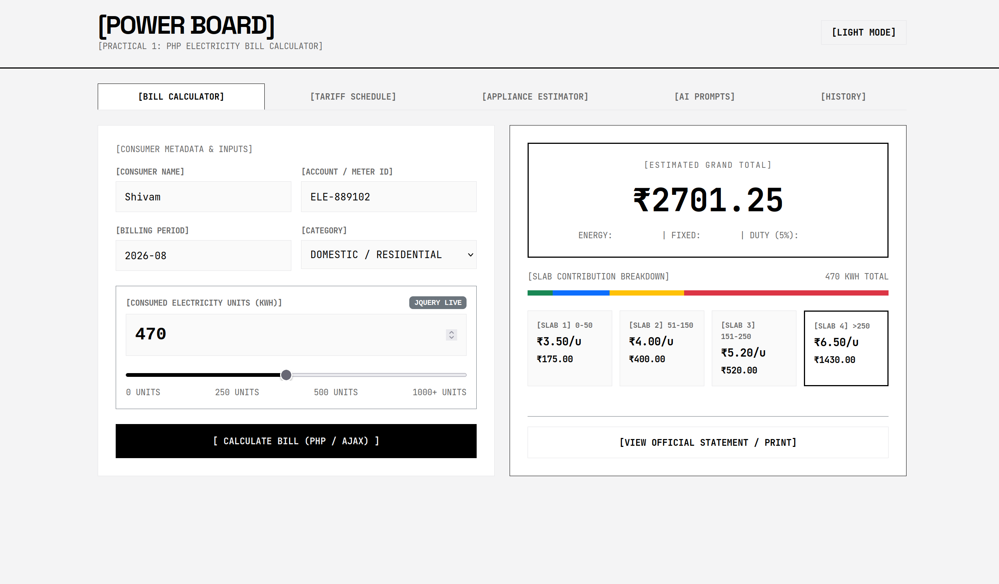
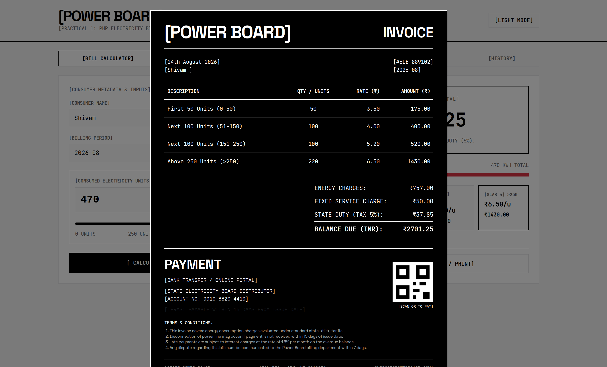

# Web Technologies Practicals and Assignments

**Repository**: `webtechnologies-assignments`  
**Course**: Web Technologies (B.Tech Computer Engineering)  

This repository contains practical assignments developed using modern web technologies including PHP 8, Bootstrap 5, jQuery, React 19, Vite, and Web Audio API.

---

## Project Overview & Screenshots

### Practical 1: PHP Electricity Bill Calculator





### Practical 2: TimeSpot Real-Time World Clock Dashboard


---

## Table of Practicals

| Practical | Title & Description | Stack | Directory |
|---|---|---|---|
| **Practical 1** | **Responsive PHP Electricity Bill Calculator**<br>Calculates multi-slab tariff bills, live input synchronization, AJAX calculations, and printable invoices. | PHP 8, Bootstrap 5, jQuery | [`Assignment1_ElectricityBill/`](./Assignment1_ElectricityBill) |
| **Practical 2** | **TimeSpot: Real-Time World Clock Dashboard**<br>Combines 60 FPS sweeping analog clock, 12h/24h digital clock, global timezone management, multi-alarm system, countdown timer, and theme customization. | React 19, Vite, SVG, Web Audio API | [`Assignment2_ClockDashboard/`](./Assignment2_ClockDashboard) |

---

## Quick Start & Local Execution

### Running Practical 1 (PHP Electricity Bill Calculator)

```bash
cd Assignment1_ElectricityBill
php -S localhost:8000
```
Open browser at `http://localhost:8000`

---

### Running Practical 2 (React Real-Time World Clock Dashboard)

```bash
cd Assignment2_ClockDashboard
npm install
npm run dev
```
Open browser at `http://localhost:5173`

---

## Detailed Documentation & Reports

- [Practical 1 Documentation](./Assignment1_ElectricityBill/DOCUMENTATION.md)
- [Practical 2 Documentation](./Assignment2_ClockDashboard/DOCUMENTATION.md)

---

## License & Academic Integrity

Prepared for **Web Technologies Practical Assessment**.
